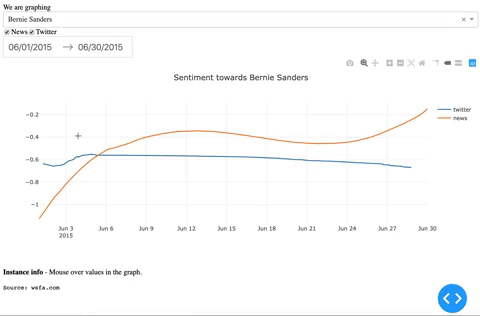

# ReputationTracker: utilize the predictive power of media

## The Problem

It's crucial for businesses and important people to understand their reputation and respond quickly when things go south. The media is a direct conduit to global opinion. News and social media contain unique information about reputation, and utilizing both can create a fuller picture than either can individually. I've created a database and visualization platform to make it easier for data scientists to derive insights from these sources.

  

## The Data

GDELT Global Knowledge Graph dataset (https://www.gdeltproject.org/) -- 2015-2016 (~1.5 TB) (csv files)
Twitter archive (https://archive.org/details/twitterstream?and%5B%5D=year%3A%222018%22h) -- 2015-2016 (~500 GB) (tar -> json.bz2 files)

## Tech Stack

- GDELT 2.0 -- data
- Twitter Archive -- data
- Amazon S3 -- storage
- Apache Spark -- distributed data processing
- PostgreSQL -- SQL database
- Dash/Plotly -- front-end
- Airflow -- ingest new GDELT data into database every 15 min

## Of interest

I used sentiment as a proxy for tone. The GDELT dataset already contained sentiment scores. I calculated the sentiment of each tweet using the Vader Sentiment package. I standardized sentiments when displaying the data to make it easier to compare the curves.
I joined the two datasets on the client mentioned in Spark. I optimized my SQL queries in the ingestion process and increased speed 8x.
I used an Airflow DAG to pull from the GDELT API every 15 minutes for up to date news data. The API makes a new CSV available every 15 minutes, which is why I chose that interval.
